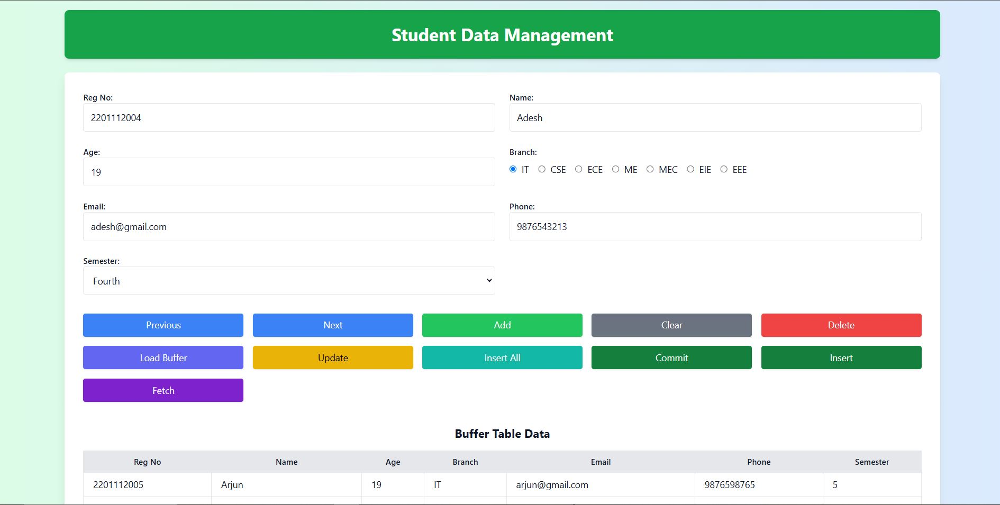
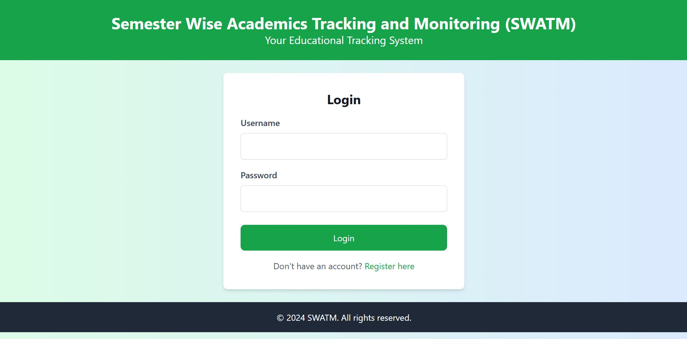
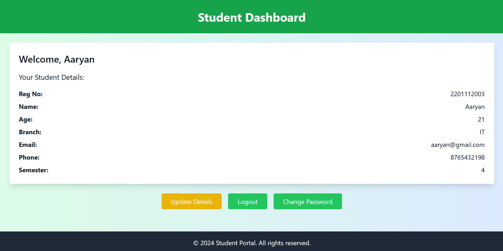

# SWATM (Student Web Attendance and Tracking Management)

SWATM is a web-based application developed for the management of student attendance and academic tracking. The system helps staff to enter and manage student attendance, while students can view their attendance and academic performance. The application also sends notifications when attendance or grades fall below a specified threshold.

## Features

- **Student Dashboard**: 
  - View attendance and academic performance.
  - Receive email notifications when performance is low.
  
- **Staff Dashboard**: 
  - Manage subjects and courses.
  - Input and update attendance and internal marks for students.

- **Admin Panel**:
  - Manage the entire system, including staff and student records.

## Technologies Used

- **Frontend**: HTML, CSS, JavaScript (with templates)
- **Backend**: Python (Flask/Django), or any relevant backend framework you used
- **Database**: MySQL/Oracle SQL
- **Version Control**: Git, GitHub
- **Email Service**: SMTP for sending email notifications
- **Deployment**: (Include any deployment tools if used, e.g., Heroku, Docker)

## Installation

1. Clone the repository:
   ```bash
   git clone https://github.com/AadhiKabilan/SWATM.git

2. Navigate to the project directory:
   ```bash
   cd SWATM

3. Install the required dependencies: If you're using Python, install the dependencies via
   ```bash
   pip install -r requirements.txt

4. Set up the database: Create the database and tables using the SQL scripts provided in sql create table.txt.
    ```bash
    sql create table.txt -> file
5. Run the application:
   ```bash
   python app.py

6. Visit http://localhost:5000 in your web browser to start using the application.
   ```bash
   http://localhost:5000

## Screen Shots

Here is the Staff data-entry page:

Here is the Login page:

Here is the Student page:

